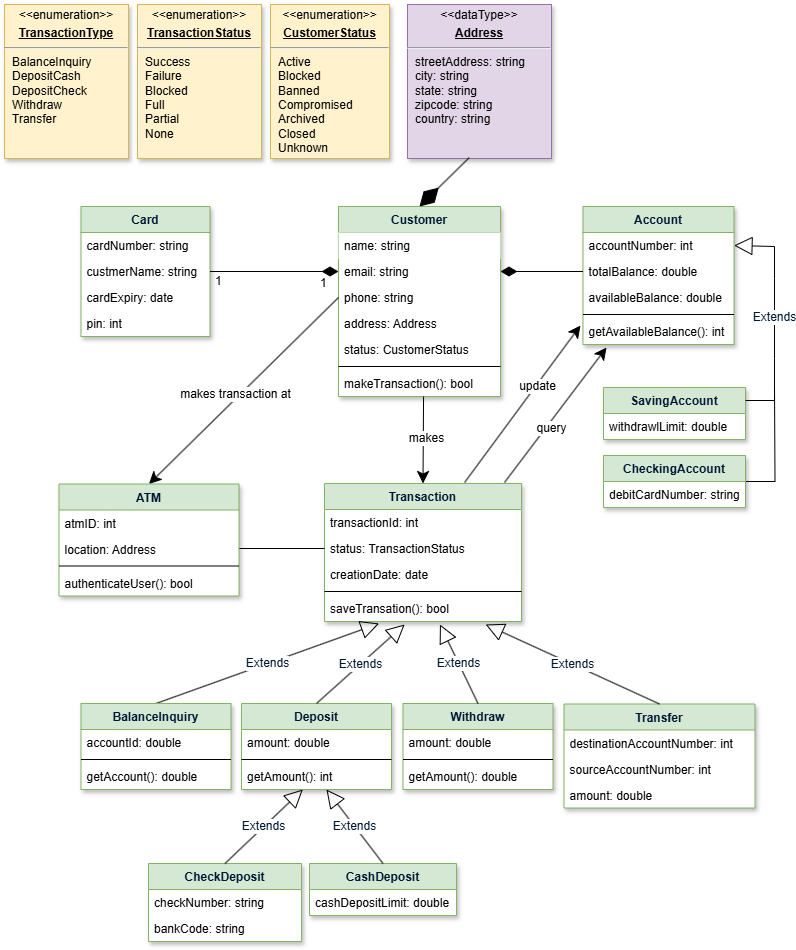

# Java Exercise

### The collection framework

[1. Storing Data Using the Collections Framework.md](docs/devJava-TheCollectionsFramework/1.%20Storing%20Data%20Using%20the%20Collections%20Framework.md)

[2. Getting to Know the Collection Hierarchy.md](docs/devJava-TheCollectionsFramework/2.%20Getting%20to%20Know%20the%20Collection%20Hierarchy.md)

[3. Storing Elements in a Collection.md](docs/devJava-TheCollectionsFramework/3.%20Storing%20Elements%20in%20a%20Collection.md)

[4. Iterating over the Elements of a Collection.md](docs/devJava-TheCollectionsFramework/4.%20Iterating%20over%20the%20Elements%20of%20a%20Collection.md)

[5. Extending Collection with List.md](docs/devJava-TheCollectionsFramework/5.%20Extending%20Collection%20with%20List.md)

[6. Extending Collection with Set, SortedSet and NavigableSet.md](docs/devJava-TheCollectionsFramework/6.%20Extending%20Collection%20with%20Set%2C%20SortedSet%20and%20NavigableSet.md)

### ATM System Implementation

