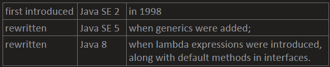
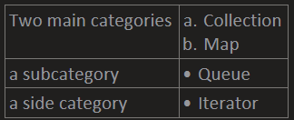
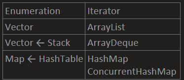
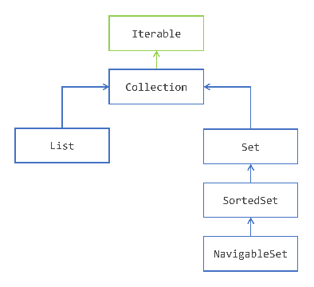
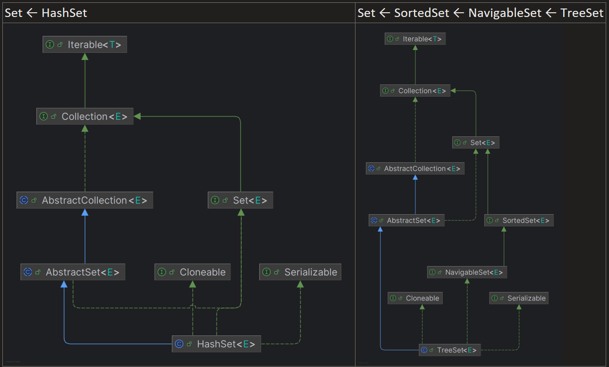
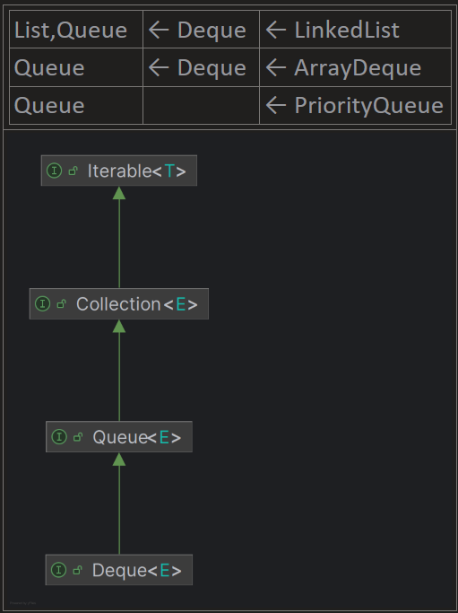
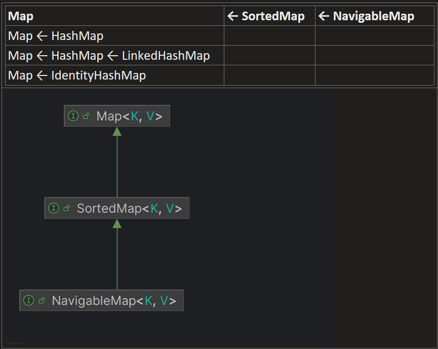
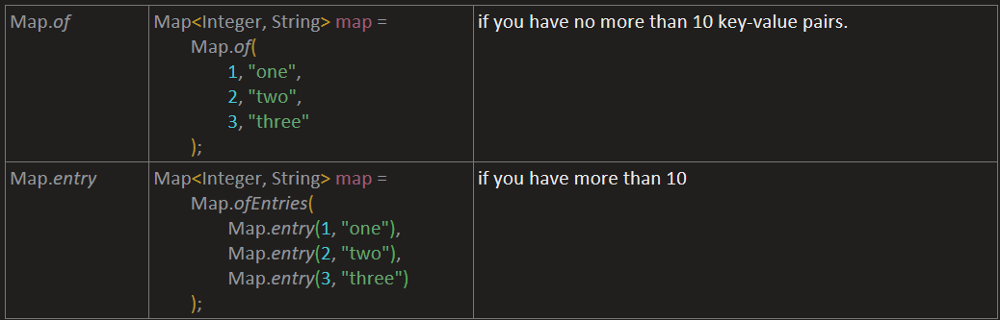

## [1. Storing Data Using the Collections Framework.md](devJava/1.%20Storing%20Data%20Using%20the%20Collections%20Framework.md)

- Introducing the Collections Framework

  

- Finding Your Way in the Collections Framework

    

- Avoiding Using Old Interfaces and Implementations

  

- Why Choose a Collection Over an Array?

  - capacity is not limited 
  - can control what elements you may store in it. 
  - provides operations like intersecting or merging with another collection. 
  - a collection is an object and given that an object is extensible,
    can add any operation on most of the collections provided by the JDK.
    It is not possible to do this with an array, because an array is not an object in Java.

## [2. Getting to Know the Collection Hierarchy.md](devJava/2.%20Getting%20to%20Know%20the%20Collection%20Hierarchy.md)

- Avoiding Getting Lost in the Collection Hierarchy

  

- The Iterable Interface
  - ← Collection
  - Java SE 5 (2004) along with the for each pattern of code
  - object that implements Iterable is an object that can iterate over.

      ```java
      Collection<String> collection = ...;
      for (String element: collection) {
      // do someting with element
      }
      ```

  - To implement the Iterable interface

    need to provide an instance of another interface, Iterator

- Storing Elements in a Container with the Collection Interface

  - Collection ← Set, List

- Extending Collection with List
  - List remembers in what order its elements have been added.

    Querying a list for its first element does make sense, since a list does remember that.

  - do not have this guarantee with a plain Collection nor for a Set.

    Querying a collection for its *first* element does not make sense.

- Extending Collection with Set
  - you cannot have duplicates in a Set.
  - adding an element to a Set may fail.
- Sorting the element of a Set with SortedSet and NavigableSet
  - Set ← SortedSet ← NavigableSet
  - SortedSet
    - Iterating from the lowest element to the greatest.
    - can extract a headSet and a tailSet of all the elements lesser than, or greater than a given element.
  - NavigableSet
    - the possibility to iterate over the elements in the descending order.

## [3. Storing Elements in a Collection.md](devJava/3.%20Storing%20Elements%20in%20a%20Collection.md)


- Exploring the Collection Interface

  `Collection` ← `List` ← `ArrayList`

- Methods That Handle Individual Elements
  - `add()`
  - `remove()`
  - `contains()`
- Methods That Handle Other Collections

  | `containsAll()` | returns true if | all present |
  | --- | --- | --- |
  | `addAll():` | returns true if | at least one has been added |
  | `removeAll():` | returns true if | at least one has been added |
  | `retainAll():` | returns true if | at least one has been added |

- Methods That Handle The Collection Itself
  - `size()`
  - `isEmpty()`
  - `clear()`
- Getting an Array of the Elements of a Collection
  1. `toArray()`

      ```java
      Collection<String> collection = List.of("a", "b", "c"); // [a, b, c]
      Object[] array = collection.toArray();                  // [a, b, c]
      String[] array1 = (String[]) array; // no guarantee that this cast will not fail at runtime
      ```

  2. `toArray(T[] tab)`

      ```java
      Collection<String> arrayList = new ArrayList<>(List.of("a", "b", "c")); // [a, b, c]
      String[] listArray = arrayList.toArray(new String[]{});                 // [a, b, c]
      String[] listArray0 = arrayList.toArray(new String[0]);                 // [a, b, c]
      String[] tabString5 = arrayList.toArray(new String[5]);                 // [a, b, c, null, null]
      ```

      ```java
      String[] array = {"a", "b", "c", "d", "e", "f"};        // [a, b, c, d, e, f]
      Collection<String> collection = List.of("1", "2");      // [1, 2]
      String[] collectionArray = collection.toArray(array);   // [1, 2, null, d, e, f]
      System.out.println((collectionArray == array));         // true
      ```

      ```java
      Collection<String> collection = List.of("a", "b");          // [a, b]
      String[] emptyArray = {};                                   // []
      String[] collectionArray = collection.toArray(emptyArray);  // [a, b]
      ```

  3. `toArray(IntFunction<T[]> generator)`

      ```java
              Collection<String> collection = List.of("a", "b", "c");         // [a, b, c]
              String[] collectionArray = collection.toArray(String[]::new);   // [a, b, c]
      ```

- Filtering out Elements of a Collection with a Predicate

    ```java
    Collection<String> collection = new ArrayList<>();
    collection.add("a");
    collection.add("");
    collection.add(null);
    collection.add("b");
    collection.add("");
    collection.add(null);
    collection.add("c");
    System.out.println(collection);     // [a, , null, b, , null, c]      
    
    collection.removeIf(((Predicate<String>) Objects::isNull).or(String::isEmpty));
    System.out.println(collection);     // [a, b, c]
    ```

- Choosing an Implementation for the Collection Interface

  `Collection` ← `List` ← `ArrayList`

## [4. Iterating over the Elements of a Collection.md](devJava/4.%20Iterating%20over%20the%20Elements%20of%20a%20Collection.md)

- **Using the for-each Pattern**

    ```java
    Collection<String> strings = List.of("a", "b", "c");
    
    for (String element: strings) {
        System.out.println(element);
    }
    ```

- Using an Iterator on a Collection

  `Collection` → `Iterable.Iterator<T> iterator();`

  1. `hasNext()`
  2. `next()`
  3. `remove()`

    ```java
    Collection<String> strings = List.of("a", "b", "c");
    for (Iterator<String> iterator = strings.iterator(); iterator.hasNext(); ) {
        System.out.println(iterator.next());
    }
    ```

- Updating a Collection While Iterating over It ❓

    ```java
    Collection<String> collection = new ArrayList<>();
    collection.add("a");
    collection.add("b");
    collection.add("c");
    
    Iterator<String> iterator = collection.iterator();
    while (iterator.hasNext()) {
        String next = iterator.next();
        if (next.equals("a")) {
            // collection.remove(next);  // ConcurrentModificationException
            iterator.remove();          // [b, c]
        }
    }
    
    ```

    ```java
    Collection<String> collection = new ArrayList<>();
    collection.add("a");
    collection.add("b");
    collection.add("c");
    
    collection.removeIf(next -> next.equals("a"));    // [b, c]
    ```

- Implementing the Iterable Interface

    ```java
    for (int i: new Iterable<Integer>() {
        @Override
        public Iterator<Integer> iterator() {
            return new Iterator<>() {
                private int index = 0;
    
                @Override
                public boolean hasNext() {
                    return index < 5;
                }
    
                @Override
                public Integer next() {
                    int currentIndex = index;
                    index++;
                    return currentIndex;
                }
            };
        }
    }) {
        System.out.println(i); // 01234
    }
    ```
  
## [5. Extending Collection with List.md](devJava/5.%20Extending%20Collection%20with%20List.md)

- Exploring the List Interface

  `Collection` ← `List`

  - The elements of a list have an index.
  - respects the order in which the elements have been added to this list.
- Choosing your Implementation of the List Interface
  - `List`
    - `ArrayList`
      - built on an internal array
      - Iterating over the elements is much faster
      - choosing a ArrayList is best choice
        - to iterate through the elements of your list,
        - to access the elements randomly by their index
    - `LinkedList`
      - built on a doubly-linked list.
      - can access its first and last element faster.
      - choosing a linked list is best choice
        - stack
        - queue
- Accessing the Elements Using an Index
  - Accessing a Single Object
    - `add(index, element)`
    - `get(index)`
    - `set(index, element)`
    - `remove(index)`
  - Finding the Index of an Object
    - `indexOf(element)`
    - `lastIndexOf(element)`
  - Getting a SubList
    - `subList(start, end)`
      - returns a list consisting of the elements between indexes `start` and `end - 1`
      - any modification operation on the sublist is reflected on the main list.

        ```java
        List<String> list = new ArrayList<>(List.of("0", "1", "2", "3"));   
        System.out.println(list);   // [0, 1, 2, 3]
        
        list.subList(1, 3).clear();                                         
        System.out.println(list);   // [0, 3]
        ```

  - **Inserting a Collection**
    - `addAll(int index, Collection collection)`.
- Sorting the Elements of a List
  - `list.sort()` [Java SE 8]
  - `Collections.sort(list)` [Java SE 7 and earlier]
- Iterating over the Elements of a List
  - `list.listIterator()`
    - `Iterator` ← `ListIterator`
      - `hasPrevious()` and `previous()`
      - `nextIndex()` and `previousIndex()`
      - `set(element)`


## [6. Extending Collection with Set, SortedSet and NavigableSet.md](devJava/6.%20Extending%20Collection%20with%20Set%2C%20SortedSet%20and%20NavigableSet.md)
    



## [8. Storing Elements in Stacks and Queues.md](devJava/8.%20Storing%20Elements%20in%20Stacks%20and%20Queues.md)



## [9. Using Maps to Store Key Value Pairs.md](devJava/9.%20Using%20Maps%20to%20Store%20Key%20Value%20Pairs.md)

### Map Hierarchy



### Using the Convenience Factory Methods for Collections to Create Maps



### Exploring the Map interface

- `getKey()`
- `getValue()`
- `setValue(value)`

## [10. Managing the Content of a Map.md](devJava/10.%20Managing%20the%20Content%20of%20a%20Map.md)

- **Adding a Key Value Pair to a Map**
    - put(k, v)
    - putIfAbsent(k, v)
- **Getting a Value From a Key**
    - getKey(k)
    - getOrDefault(k,"default")
- **Removing a Key from a Map**
    - remove(k)
    - remove(k,v)
- **Checking for the Presence of a Key or a Value**
    - containsKey(k)
    - containsValue(v)
- **Checking for the Content of a Map**
    - isEmpty
    - size()
    - clear()
    - putAll(oMap)
- **Getting a View on the Keys, the Values or the Entries of a Map**
    - keySet()
    - entrySet()
    - values()
- **Removing a Key From the Set of Keys**
    - keySet().remove(o)
- **Removing a Value From the Collection of Values**
    - values().remove(o)

      - Removing a value is not as simple because a value can be found more than once in a map. In that case, removing a value from the collection of values just removes the first matching key/value pair.

      - need to be careful in this case because if the implementation you chose is a HashMap, you cannot tell in advance what key/value pair will be found.

    - best choice is to iterate directly on the set of key/value pairs

        ```java
        for (Map.Entry<Integer, String> entry : map.entrySet()) {
        	System.*out*.println("entry = " + entry);
        }
        ```